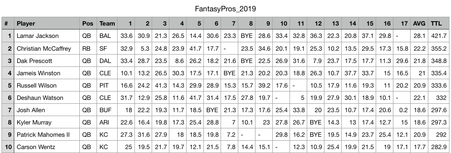

# Project-4
## NFL Fantasy Football Stats
## Overview
For this project we researched NFL fantasy football data provided by Fantasy Pros. We looked at the years 2019-2023. The records included team, player rank, position, points accumulated for each of the 18 weeks, the average amount of points, and the total amount of points for each season. We aimed to build a model that could predict the total amount of points each player would score for the upcoming season, which could then be used to predict the player's rank.
## Ethical Consideration
This project was conducted for educational purposes only, and should not be used to influence one's decisions regarding their participation in any fantasy football related events or activities. Any transformation of the data as apart of this project did not alter or manipulate player stats in any way.
## The Data
As mentioned previously, we focused on the years 2019-2023 to build our prediction model.
- 
